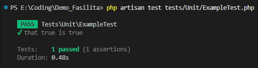
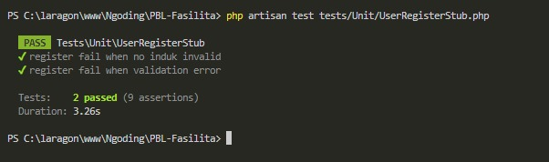

# Hasil Testing Laravel Unit - Kelompok 3

Anggota Kelompok:
1. `2341720144` - Danendra Nayaka Passadhi
2. `2341720176` - Farrel Muchammad Kafie
3. `2341720003` - Fatikah Salsabilla
4. `2341720168` - Muhammad Afif Al-Ghifari

Kelas: TI-3H

## Hasil Testing

Berikut adalah hasil testing Laravel Unit:

**Penjelasan Test 1:**
Pengujian ini dilakukan pada file `ExampleTest.php`. Ini adalah pengujian dasar (sanity check) untuk memastikan bahwa framework testing (PHPUnit) di Laravel telah terkonfigurasi dengan benar. Hasil `PASS` dengan asersi "that true is true" menandakan lingkungan pengujian berfungsi normal dan siap menjalankan tes yang lebih kompleks.

**Penjelasan Test 2:**
Pengujian ini dilakukan pada file UserRegisterStub.php yang bertujuan untuk memvalidasi logika registrasi pengguna. Hasil tes menunjukkan status PASS pada dua skenario pengujian negatif (negative cases):
1. register fail when no induk invalid: Memastikan sistem menolak registrasi jika "No Induk" tidak valid.
2. register fail when validation error: Memastikan sistem menolak registrasi jika input tidak memenuhi aturan validasi.

**Kesimpulan:**  
Berdasarkan hasil pengujian di atas, dapat disimpulkan bahwa konfigurasi lingkungan testing telah berhasil dan unit test untuk fitur registrasi (UserRegisterStub) berjalan sesuai harapan. Sistem telah terbukti **mampu menangani kegagalan input (validasi error dan data invalid)** dengan benar tanpa menyebabkan crash, menjaga integritas data aplikasi.
