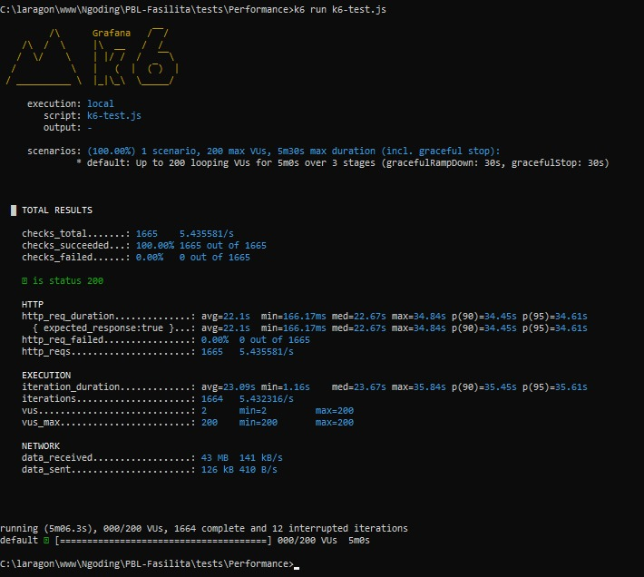

# Hasil Testing K6 - Kelompok 3

Anggota Kelompok:
1. `2341720144` - Danendra Nayaka Passadhi
2. `2341720176` - Farrel Muchammad Kafie
3. `2341720003` - Fatikah Salsabilla
4. `2341720168` - Muhammad Afif Al-Ghifari

Kelas: TI-3H

## Hasil Testing K6

Berikut adalah hasil testing Laravel Unit:

## Penjelasan Hasil Testing K6

### 1. Keandalan (Reliability)
- Status Sukses: 100% request berhasil (`checks_succeeded`).
- Error Rate: 0.00% kegagalan (`http_req_failed dan checks_failed`).
> Artinya: Server stabil dan tidak crash atau melempar error (seperti 500 Internal Server Error) meskipun dibebani hingga 200 Virtual Users (VUs).

### 2. Latensi / Waktu Respons (Performance)
- Rata-rata (avg): 22.1 detik.
- Median (med): 22.67 detik.
- P95 (p(95)): 34.61 detik (artinya 5% user terlambat merasakan loading hingga 34 detik).
> Artinya: Meskipun server tidak error, responsnya sangat lambat. Standan server Anda stabil dan tidak crash atau melempar error (seperti 500 Internal Server Error) meskipun dibebani hingga 200 Virtual Users (VUs).

### 3. Kapasitas & Throughput
- Total Request: 1665 request selama 5 menit.
- Rata-rata Request: ~5.4 request per detik.
- Beban Pengguna: Skenario dijalankan dengan target hingga 200 VUs (Virtual Users).